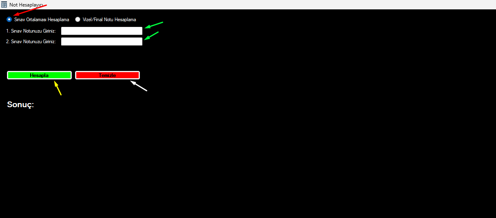

# Not-Hesaplama
    Üniversite Not Hesaplama

    Bu bir üniversite not hesaplama uygulamasıdır
    
    Aşağıdaki görseldeki kırmızı ok ile seçili olan kısım seçili ise direkt olarak 
    yeşil oklarla gösterilen yerlere notları girmeniz ve daha sonrasında sarı okla 
    gösterilen hesaplamaya tıklayınız ve bu yöntem 2 sınav üzerinden direkt 
    ortalamanızı hesaplayacaktır.

       
